# 🏗️ Arquitectura del Sistema - Equipment Management System

## Diagrama de Arquitectura

```mermaid
graph TB
    subgraph "Frontend - Flutter (Vercel)"
        subgraph "Capa de Presentación"
            MAIN[main.dart<br/>Entry Point + Firebase Init]
            
            subgraph "Screens - Páginas"
                LOGIN[login_screen.dart<br/>Autenticación]
                REGISTER[register_screen.dart<br/>Registro Usuario]
                DISPONIBILIDAD[disponibilidad_screen.dart<br/>Ver Equipos Disponibles]
                RESERVACION[reservacion_screen.dart<br/>Crear Reserva]
                CONFIRM_RES[confirmacion_reservacion_screen.dart<br/>Confirmar Reserva]
                RETORNO[retorno_screen.dart<br/>Devolver Equipo]
                CONFIRM[confirmacion_screen.dart<br/>Confirmación General]
                GESTION_EQ[gestion_equipos_screen.dart<br/>CRUD Equipos]
                GESTION_FORM[gestion_equipos_form_screen.dart<br/>Formulario Equipos]
                DASHBOARD_P[dashboard_screen.dart<br/>Métricas y Estadísticas]
            end
        end
        
        subgraph "Capa de Servicios"
            AUTH_S[auth_service.dart<br/>Login, Register, Logout, Refresh]
            EQUIPMENT_S[equipment_service.dart<br/>CRUD + Búsqueda + Filtros]
            RESERVATION_S[reservation_service.dart<br/>CRUD Reservas + Validaciones]
            DASHBOARD_S[dashboard_service.dart<br/>Métricas Agregadas]
            NOTIFICATION_S[notification_service.dart<br/>Push Notifications FCM]
            STORAGE_S[storage_service.dart<br/>SharedPreferences<br/>Token + User Data]
        end
        
        subgraph "Capa de Modelos"
            USER_M[user.dart<br/>Usuario]
            EQUIPMENT_M[equipment.dart<br/>Equipo]
            RESERVATION_M[reservation.dart<br/>Reserva/Préstamo]
            DASHBOARD_M[dashboard.dart<br/>Datos Dashboard]
        end
        
        subgraph "Configuración"
            API_CONFIG[api_config.dart<br/>Endpoints + Headers]
            ENV_CONFIG[environment_config.dart<br/>Backend URL]
            FIREBASE_OPT[firebase_options.dart<br/>Firebase Config]
        end
    end
    
    subgraph "Backend - Node.js/Express (Render)"
        subgraph "Entry Point"
            INDEX[index.ts<br/>Server Startup]
            APP[app.ts<br/>Express App Config<br/>CORS + Middlewares]
        end
        
        subgraph "Rutas API"
            AUTH_R[auth.routes.ts<br/>/api/auth]
            EQUIPMENT_R[equipment.routes.ts<br/>/api/equipment]
            LOAN_R[loan.routes.ts<br/>/api/loans]
            NOTIFICATION_R[notification.routes.ts<br/>/api/notifications]
            DASHBOARD_R[dashboard.routes.ts<br/>/api/dashboard]
            REPORT_R[report.routes.ts<br/>/api/reports]
            USER_R[user.routes.ts<br/>/api/users]
        end
        
        subgraph "Controladores"
            AUTH_C[AuthController.ts<br/>HTTP Request Handler]
            EQUIPMENT_C[EquipmentController.ts<br/>HTTP Request Handler]
            LOAN_C[LoanController.ts<br/>HTTP Request Handler]
            NOTIFICATION_C[NotificationController.ts<br/>HTTP Request Handler]
            DASHBOARD_C[DashboardController.ts<br/>HTTP Request Handler]
            REPORT_C[ReportController.ts<br/>HTTP Request Handler]
            USER_C[UserController.ts<br/>HTTP Request Handler]
        end
        
        subgraph "Servicios de Negocio"
            AUTH_SVC[AuthService.ts<br/>Lógica Autenticación<br/>JWT + Refresh Tokens]
            EQUIPMENT_SVC[EquipmentService.ts<br/>Lógica CRUD Equipos]
            LOAN_SVC[LoanService.ts<br/>Lógica Reservas<br/>Validaciones + Cron Jobs]
            NOTIFICATION_SVC[NotificationService.ts<br/>Push Notifications<br/>FCM Integration]
            DASHBOARD_SVC[DashboardService.ts<br/>Agregación Datos]
            REPORT_SVC[ReportService.ts<br/>Generación Reportes]
            USER_SVC[UserService.ts<br/>Lógica Usuarios]
        end
        
        subgraph "Modelos de Datos"
            USER_MODEL[User.ts<br/>Mongoose Schema]
            EQUIPMENT_MODEL[Equipment.ts<br/>Mongoose Schema]
            LOAN_MODEL[Loan.ts<br/>Mongoose Schema]
            NOTIFICATION_MODEL[Notification.ts<br/>Mongoose Schema]
            FCM_MODEL[FCMToken.ts<br/>Mongoose Schema]
        end
        
        subgraph "Middlewares"
            AUTH_MW[auth.ts<br/>JWT Verification]
            ROLE_MW[role.ts<br/>RBAC Authorization]
            VALIDATORS[validators.ts<br/>Request Validation]
            RATE_LIMITER[rateLimiter.ts<br/>Rate Limiting]
            ERROR_HANDLER[errorHandler.ts<br/>Error Handling]
        end
        
        subgraph "Utilidades"
            JWT_UTIL[jwt.ts<br/>JWT Generation/Verification]
            REDIS_UTIL[redis.ts<br/>Redis Client<br/>Token Storage]
        end
        
        subgraph "Configuración"
            CONFIG[config/index.ts<br/>Environment Variables]
        end
    end
    
    subgraph "Base de Datos"
        MONGODB[(MongoDB Atlas<br/>Datos Persistentes)]
        REDIS[(Redis Upstash<br/>Refresh Tokens<br/>Cache)]
    end
    
    subgraph "Servicios Externos"
        FIREBASE[Firebase Cloud Messaging<br/>Push Notifications]
    end
    
    %% Frontend Connections
    MAIN --> LOGIN
    MAIN --> REGISTER
    MAIN --> DISPONIBILIDAD
    MAIN --> RESERVACION
    MAIN --> CONFIRM_RES
    MAIN --> RETORNO
    MAIN --> CONFIRM
    MAIN --> GESTION_EQ
    MAIN --> GESTION_FORM
    MAIN --> DASHBOARD_P
    
    LOGIN --> AUTH_S
    REGISTER --> AUTH_S
    DISPONIBILIDAD --> EQUIPMENT_S
    RESERVACION --> RESERVATION_S
    RETORNO --> RESERVATION_S
    GESTION_EQ --> EQUIPMENT_S
    DASHBOARD_P --> DASHBOARD_S
    DASHBOARD_P --> NOTIFICATION_S
    
    AUTH_S --> STORAGE_S
    AUTH_S --> API_CONFIG
    EQUIPMENT_S --> API_CONFIG
    RESERVATION_S --> API_CONFIG
    DASHBOARD_S --> API_CONFIG
    NOTIFICATION_S --> API_CONFIG
    NOTIFICATION_S --> FIREBASE
    
    API_CONFIG --> ENV_CONFIG
    ENV_CONFIG --> BACKEND_API
    
    AUTH_S --> USER_M
    EQUIPMENT_S --> EQUIPMENT_M
    RESERVATION_S --> RESERVATION_M
    DASHBOARD_S --> DASHBOARD_M
    
    %% Backend Connections
    INDEX --> APP
    APP --> AUTH_R
    APP --> EQUIPMENT_R
    APP --> LOAN_R
    APP --> NOTIFICATION_R
    APP --> DASHBOARD_R
    APP --> REPORT_R
    APP --> USER_R
    
    AUTH_R --> AUTH_MW
    AUTH_R --> VALIDATORS
    AUTH_R --> RATE_LIMITER
    AUTH_R --> AUTH_C
    
    EQUIPMENT_R --> AUTH_MW
    EQUIPMENT_R --> ROLE_MW
    EQUIPMENT_R --> VALIDATORS
    EQUIPMENT_R --> EQUIPMENT_C
    
    LOAN_R --> AUTH_MW
    LOAN_R --> ROLE_MW
    LOAN_R --> VALIDATORS
    LOAN_R --> LOAN_C
    
    NOTIFICATION_R --> AUTH_MW
    NOTIFICATION_R --> ROLE_MW
    NOTIFICATION_R --> NOTIFICATION_C
    
    DASHBOARD_R --> AUTH_MW
    DASHBOARD_R --> ROLE_MW
    DASHBOARD_R --> DASHBOARD_C
    
    REPORT_R --> AUTH_MW
    REPORT_R --> ROLE_MW
    REPORT_R --> REPORT_C
    
    USER_R --> AUTH_MW
    USER_R --> ROLE_MW
    USER_R --> USER_C
    
    AUTH_C --> AUTH_SVC
    EQUIPMENT_C --> EQUIPMENT_SVC
    LOAN_C --> LOAN_SVC
    NOTIFICATION_C --> NOTIFICATION_SVC
    DASHBOARD_C --> DASHBOARD_SVC
    REPORT_C --> REPORT_SVC
    USER_C --> USER_SVC
    
    AUTH_SVC --> USER_MODEL
    AUTH_SVC --> JWT_UTIL
    AUTH_SVC --> REDIS_UTIL
    EQUIPMENT_SVC --> EQUIPMENT_MODEL
    LOAN_SVC --> LOAN_MODEL
    LOAN_SVC --> EQUIPMENT_MODEL
    LOAN_SVC --> USER_MODEL
    NOTIFICATION_SVC --> NOTIFICATION_MODEL
    NOTIFICATION_SVC --> FCM_MODEL
    NOTIFICATION_SVC --> FIREBASE
    DASHBOARD_SVC --> LOAN_MODEL
    DASHBOARD_SVC --> EQUIPMENT_MODEL
    DASHBOARD_SVC --> USER_MODEL
    REPORT_SVC --> LOAN_MODEL
    REPORT_SVC --> EQUIPMENT_MODEL
    USER_SVC --> USER_MODEL
    
    APP --> ERROR_HANDLER
    
    CONFIG --> APP
    CONFIG --> AUTH_SVC
    CONFIG --> REDIS_UTIL
    
    %% Database Connections
    USER_MODEL --> MONGODB
    EQUIPMENT_MODEL --> MONGODB
    LOAN_MODEL --> MONGODB
    NOTIFICATION_MODEL --> MONGODB
    FCM_MODEL --> MONGODB
    
    REDIS_UTIL --> REDIS
    
    %% External API
    BACKEND_API[Backend API<br/>https://vb-lin-backend.onrender.com/api]
    
    %% Styling
    classDef frontend fill:#e1f5ff,stroke:#01579b,stroke-width:2px
    classDef backend fill:#fff3e0,stroke:#e65100,stroke-width:2px
    classDef database fill:#f3e5f5,stroke:#4a148c,stroke-width:2px
    classDef external fill:#e8f5e9,stroke:#1b5e20,stroke-width:2px
    
    class MAIN,LOGIN,REGISTER,DISPONIBILIDAD,RESERVACION,CONFIRM_RES,RETORNO,CONFIRM,GESTION_EQ,GESTION_FORM,DASHBOARD_P,AUTH_S,EQUIPMENT_S,RESERVATION_S,DASHBOARD_S,NOTIFICATION_S,STORAGE_S,USER_M,EQUIPMENT_M,RESERVATION_M,DASHBOARD_M,API_CONFIG,ENV_CONFIG,FIREBASE_OPT frontend
    class INDEX,APP,AUTH_R,EQUIPMENT_R,LOAN_R,NOTIFICATION_R,DASHBOARD_R,REPORT_R,USER_R,AUTH_C,EQUIPMENT_C,LOAN_C,NOTIFICATION_C,DASHBOARD_C,REPORT_C,USER_C,AUTH_SVC,EQUIPMENT_SVC,LOAN_SVC,NOTIFICATION_SVC,DASHBOARD_SVC,REPORT_SVC,USER_SVC,USER_MODEL,EQUIPMENT_MODEL,LOAN_MODEL,NOTIFICATION_MODEL,FCM_MODEL,AUTH_MW,ROLE_MW,VALIDATORS,RATE_LIMITER,ERROR_HANDLER,JWT_UTIL,REDIS_UTIL,CONFIG backend
    class MONGODB,REDIS database
    class FIREBASE,BACKEND_API external
```

## 📋 Descripción de Capas

### Frontend (Flutter)
- **Capa de Presentación**: Screens/Páginas de la aplicación
- **Capa de Servicios**: Lógica de negocio y comunicación con API
- **Capa de Modelos**: Modelos de datos (con JSON serialization)
- **Configuración**: URLs, endpoints y configuración de Firebase

### Backend (Node.js/Express)
- **Entry Point**: Inicialización del servidor
- **Rutas**: Definición de endpoints REST
- **Controladores**: Manejo de requests HTTP
- **Servicios**: Lógica de negocio
- **Modelos**: Esquemas de Mongoose
- **Middlewares**: Autenticación, autorización, validación, rate limiting
- **Utilidades**: JWT, Redis client
- **Configuración**: Variables de entorno

### Base de Datos
- **MongoDB Atlas**: Datos persistentes (usuarios, equipos, préstamos, notificaciones)
- **Redis Upstash**: Almacenamiento de refresh tokens y cache

### Servicios Externos
- **Firebase Cloud Messaging**: Push notifications

## 🔄 Flujo de Datos

1. **Autenticación**: Frontend → AuthService → Backend API → AuthController → AuthService → MongoDB/Redis
2. **Reservas**: Frontend → ReservationService → Backend API → LoanController → LoanService → MongoDB
3. **Notificaciones**: Backend → NotificationService → Firebase → Frontend
4. **Dashboard**: Frontend → DashboardService → Backend API → DashboardController → DashboardService → MongoDB

## 🔐 Seguridad

- **JWT Tokens**: Access tokens (2h) y Refresh tokens (7d)
- **RBAC**: Roles (estudiante, profesor, admin)
- **Rate Limiting**: Protección contra abuso
- **Validación**: Express-validator en todas las rutas
- **CORS**: Configurado para producción

