# VB-Lin_BackEnd - Sistema de Gestión de Préstamo de Equipos

Backend RESTful completo desarrollado en **TypeScript + Node.js + Express + MongoDB (Mongoose)** para el sistema de gestión de préstamo de equipos en laboratorios de la Universidad Autónoma de Aguascalientes (UAA).

## 📋 Tabla de Contenidos

- [Características](#-características)
- [Arquitectura del Sistema](#️-arquitectura-del-sistema)
- [Requisitos Previos](#-requisitos-previos)
- [Instalación Rápida](#-instalación-rápida)
- [Configuración](#-configuración)
- [Ejecución Local](#-ejecución-local)
- [Docker Compose](#-docker-compose)
- [Documentación API](#-documentación-api)
- [Autenticación para Flutter](#-autenticación-para-flutter)
- [Endpoints](#-endpoints)
- [Tests](#-tests)
- [Estructura del Proyecto](#-estructura-del-proyecto)

## 🚀 Características

- ✅ **TypeScript** con tipado fuerte
- ✅ **Express.js** con arquitectura modular
- ✅ **MongoDB** con Mongoose ODM (BD: `VB-Lin_BackEnd`)
- ✅ **Redis (ioredis)** para gestión de refresh tokens
- ✅ **JWT** con access tokens (2h) y refresh tokens (7d) con rotación
- ✅ **RBAC** (Role-Based Access Control) con roles: `estudiante`, `profesor`, `admin`
- ✅ **Validación** con express-validator
- ✅ **Seguridad** con helmet, CORS, rate limiting, sanitización
- ✅ **Tests** con Jest y Supertest (unit e integration)
- ✅ **Docker** y Docker Compose para desarrollo y producción
- ✅ **CI/CD** con GitHub Actions (workflow básico y tolerante)
- ✅ **Swagger/OpenAPI** para documentación interactiva de API
- ✅ **Push Notifications** con Firebase Admin (simulado si no hay credenciales)
- ✅ **Email** con Nodemailer (SMTP)

## 🏗️ Arquitectura del Sistema

```mermaid
graph TB
    subgraph "Frontend - Flutter (Vercel)"
        subgraph "Capa de Presentación"
            MAIN[main.dart<br/>Entry Point + Firebase Init]
            
            subgraph "Screens - Páginas"
                LOGIN[login_screen.dart<br/>Autenticación]
                REGISTER[register_screen.dart<br/>Registro Usuario]
                DISPONIBILIDAD[disponibilidad_screen.dart<br/>Ver Equipos Disponibles]
                RESERVACION[reservacion_screen.dart<br/>Crear Reserva]
                CONFIRM_RES[confirmacion_reservacion_screen.dart<br/>Confirmar Reserva]
                RETORNO[retorno_screen.dart<br/>Devolver Equipo]
                CONFIRM[confirmacion_screen.dart<br/>Confirmación General]
                GESTION_EQ[gestion_equipos_screen.dart<br/>CRUD Equipos]
                GESTION_FORM[gestion_equipos_form_screen.dart<br/>Formulario Equipos]
                DASHBOARD_P[dashboard_screen.dart<br/>Métricas y Estadísticas]
            end
        end
        
        subgraph "Capa de Servicios"
            AUTH_S[auth_service.dart<br/>Login, Register, Logout, Refresh]
            EQUIPMENT_S[equipment_service.dart<br/>CRUD + Búsqueda + Filtros]
            RESERVATION_S[reservation_service.dart<br/>CRUD Reservas + Validaciones]
            DASHBOARD_S[dashboard_service.dart<br/>Métricas Agregadas]
            NOTIFICATION_S[notification_service.dart<br/>Push Notifications FCM]
            STORAGE_S[storage_service.dart<br/>SharedPreferences<br/>Token + User Data]
        end
        
        subgraph "Capa de Modelos"
            USER_M[user.dart<br/>Usuario]
            EQUIPMENT_M[equipment.dart<br/>Equipo]
            RESERVATION_M[reservation.dart<br/>Reserva/Préstamo]
            DASHBOARD_M[dashboard.dart<br/>Datos Dashboard]
        end
        
        subgraph "Configuración"
            API_CONFIG[api_config.dart<br/>Endpoints + Headers]
            ENV_CONFIG[environment_config.dart<br/>Backend URL]
            FIREBASE_OPT[firebase_options.dart<br/>Firebase Config]
        end
    end
    
    subgraph "Backend - Node.js/Express (Render)"
        subgraph "Entry Point"
            INDEX[index.ts<br/>Server Startup]
            APP[app.ts<br/>Express App Config<br/>CORS + Middlewares]
        end
        
        subgraph "Rutas API"
            AUTH_R[auth.routes.ts<br/>/api/auth]
            EQUIPMENT_R[equipment.routes.ts<br/>/api/equipment]
            LOAN_R[loan.routes.ts<br/>/api/loans]
            NOTIFICATION_R[notification.routes.ts<br/>/api/notifications]
            DASHBOARD_R[dashboard.routes.ts<br/>/api/dashboard]
            REPORT_R[report.routes.ts<br/>/api/reports]
            USER_R[user.routes.ts<br/>/api/users]
        end
        
        subgraph "Controladores"
            AUTH_C[AuthController.ts<br/>HTTP Request Handler]
            EQUIPMENT_C[EquipmentController.ts<br/>HTTP Request Handler]
            LOAN_C[LoanController.ts<br/>HTTP Request Handler]
            NOTIFICATION_C[NotificationController.ts<br/>HTTP Request Handler]
            DASHBOARD_C[DashboardController.ts<br/>HTTP Request Handler]
            REPORT_C[ReportController.ts<br/>HTTP Request Handler]
            USER_C[UserController.ts<br/>HTTP Request Handler]
        end
        
        subgraph "Servicios de Negocio"
            AUTH_SVC[AuthService.ts<br/>Lógica Autenticación<br/>JWT + Refresh Tokens]
            EQUIPMENT_SVC[EquipmentService.ts<br/>Lógica CRUD Equipos]
            LOAN_SVC[LoanService.ts<br/>Lógica Reservas<br/>Validaciones + Cron Jobs]
            NOTIFICATION_SVC[NotificationService.ts<br/>Push Notifications<br/>FCM Integration]
            DASHBOARD_SVC[DashboardService.ts<br/>Agregación Datos]
            REPORT_SVC[ReportService.ts<br/>Generación Reportes]
            USER_SVC[UserService.ts<br/>Lógica Usuarios]
        end
        
        subgraph "Modelos de Datos"
            USER_MODEL[User.ts<br/>Mongoose Schema]
            EQUIPMENT_MODEL[Equipment.ts<br/>Mongoose Schema]
            LOAN_MODEL[Loan.ts<br/>Mongoose Schema]
            NOTIFICATION_MODEL[Notification.ts<br/>Mongoose Schema]
            FCM_MODEL[FCMToken.ts<br/>Mongoose Schema]
        end
        
        subgraph "Middlewares"
            AUTH_MW[auth.ts<br/>JWT Verification]
            ROLE_MW[role.ts<br/>RBAC Authorization]
            VALIDATORS[validators.ts<br/>Request Validation]
            RATE_LIMITER[rateLimiter.ts<br/>Rate Limiting]
            ERROR_HANDLER[errorHandler.ts<br/>Error Handling]
        end
        
        subgraph "Utilidades"
            JWT_UTIL[jwt.ts<br/>JWT Generation/Verification]
            REDIS_UTIL[redis.ts<br/>Redis Client<br/>Token Storage]
        end
        
        subgraph "Configuración"
            CONFIG[config/index.ts<br/>Environment Variables]
        end
    end
    
    subgraph "Base de Datos"
        MONGODB[(MongoDB Atlas<br/>Datos Persistentes)]
        REDIS[(Redis Upstash<br/>Refresh Tokens<br/>Cache)]
    end
    
    subgraph "Servicios Externos"
        FIREBASE[Firebase Cloud Messaging<br/>Push Notifications]
    end
    
    %% Frontend Connections
    MAIN --> LOGIN
    MAIN --> REGISTER
    MAIN --> DISPONIBILIDAD
    MAIN --> RESERVACION
    MAIN --> CONFIRM_RES
    MAIN --> RETORNO
    MAIN --> CONFIRM
    MAIN --> GESTION_EQ
    MAIN --> GESTION_FORM
    MAIN --> DASHBOARD_P
    
    LOGIN --> AUTH_S
    REGISTER --> AUTH_S
    DISPONIBILIDAD --> EQUIPMENT_S
    RESERVACION --> RESERVATION_S
    RETORNO --> RESERVATION_S
    GESTION_EQ --> EQUIPMENT_S
    DASHBOARD_P --> DASHBOARD_S
    DASHBOARD_P --> NOTIFICATION_S
    
    AUTH_S --> STORAGE_S
    AUTH_S --> API_CONFIG
    EQUIPMENT_S --> API_CONFIG
    RESERVATION_S --> API_CONFIG
    DASHBOARD_S --> API_CONFIG
    NOTIFICATION_S --> API_CONFIG
    NOTIFICATION_S --> FIREBASE
    
    API_CONFIG --> ENV_CONFIG
    ENV_CONFIG --> BACKEND_API
    
    AUTH_S --> USER_M
    EQUIPMENT_S --> EQUIPMENT_M
    RESERVATION_S --> RESERVATION_M
    DASHBOARD_S --> DASHBOARD_M
    
    %% Backend Connections
    INDEX --> APP
    APP --> AUTH_R
    APP --> EQUIPMENT_R
    APP --> LOAN_R
    APP --> NOTIFICATION_R
    APP --> DASHBOARD_R
    APP --> REPORT_R
    APP --> USER_R
    
    AUTH_R --> AUTH_MW
    AUTH_R --> VALIDATORS
    AUTH_R --> RATE_LIMITER
    AUTH_R --> AUTH_C
    
    EQUIPMENT_R --> AUTH_MW
    EQUIPMENT_R --> ROLE_MW
    EQUIPMENT_R --> VALIDATORS
    EQUIPMENT_R --> EQUIPMENT_C
    
    LOAN_R --> AUTH_MW
    LOAN_R --> ROLE_MW
    LOAN_R --> VALIDATORS
    LOAN_R --> LOAN_C
    
    NOTIFICATION_R --> AUTH_MW
    NOTIFICATION_R --> ROLE_MW
    NOTIFICATION_R --> NOTIFICATION_C
    
    DASHBOARD_R --> AUTH_MW
    DASHBOARD_R --> ROLE_MW
    DASHBOARD_R --> DASHBOARD_C
    
    REPORT_R --> AUTH_MW
    REPORT_R --> ROLE_MW
    REPORT_R --> REPORT_C
    
    USER_R --> AUTH_MW
    USER_R --> ROLE_MW
    USER_R --> USER_C
    
    AUTH_C --> AUTH_SVC
    EQUIPMENT_C --> EQUIPMENT_SVC
    LOAN_C --> LOAN_SVC
    NOTIFICATION_C --> NOTIFICATION_SVC
    DASHBOARD_C --> DASHBOARD_SVC
    REPORT_C --> REPORT_SVC
    USER_C --> USER_SVC
    
    AUTH_SVC --> USER_MODEL
    AUTH_SVC --> JWT_UTIL
    AUTH_SVC --> REDIS_UTIL
    EQUIPMENT_SVC --> EQUIPMENT_MODEL
    LOAN_SVC --> LOAN_MODEL
    LOAN_SVC --> EQUIPMENT_MODEL
    LOAN_SVC --> USER_MODEL
    NOTIFICATION_SVC --> NOTIFICATION_MODEL
    NOTIFICATION_SVC --> FCM_MODEL
    NOTIFICATION_SVC --> FIREBASE
    DASHBOARD_SVC --> LOAN_MODEL
    DASHBOARD_SVC --> EQUIPMENT_MODEL
    DASHBOARD_SVC --> USER_MODEL
    REPORT_SVC --> LOAN_MODEL
    REPORT_SVC --> EQUIPMENT_MODEL
    USER_SVC --> USER_MODEL
    
    APP --> ERROR_HANDLER
    
    CONFIG --> APP
    CONFIG --> AUTH_SVC
    CONFIG --> REDIS_UTIL
    
    %% Database Connections
    USER_MODEL --> MONGODB
    EQUIPMENT_MODEL --> MONGODB
    LOAN_MODEL --> MONGODB
    NOTIFICATION_MODEL --> MONGODB
    FCM_MODEL --> MONGODB
    
    REDIS_UTIL --> REDIS
    
    %% External API
    BACKEND_API[Backend API<br/>https://vb-lin-backend.onrender.com/api]
    
    %% Styling
    classDef frontend fill:#e1f5ff,stroke:#01579b,stroke-width:2px
    classDef backend fill:#fff3e0,stroke:#e65100,stroke-width:2px
    classDef database fill:#f3e5f5,stroke:#4a148c,stroke-width:2px
    classDef external fill:#e8f5e9,stroke:#1b5e20,stroke-width:2px
    
    class MAIN,LOGIN,REGISTER,DISPONIBILIDAD,RESERVACION,CONFIRM_RES,RETORNO,CONFIRM,GESTION_EQ,GESTION_FORM,DASHBOARD_P,AUTH_S,EQUIPMENT_S,RESERVATION_S,DASHBOARD_S,NOTIFICATION_S,STORAGE_S,USER_M,EQUIPMENT_M,RESERVATION_M,DASHBOARD_M,API_CONFIG,ENV_CONFIG,FIREBASE_OPT frontend
    class INDEX,APP,AUTH_R,EQUIPMENT_R,LOAN_R,NOTIFICATION_R,DASHBOARD_R,REPORT_R,USER_R,AUTH_C,EQUIPMENT_C,LOAN_C,NOTIFICATION_C,DASHBOARD_C,REPORT_C,USER_C,AUTH_SVC,EQUIPMENT_SVC,LOAN_SVC,NOTIFICATION_SVC,DASHBOARD_SVC,REPORT_SVC,USER_SVC,USER_MODEL,EQUIPMENT_MODEL,LOAN_MODEL,NOTIFICATION_MODEL,FCM_MODEL,AUTH_MW,ROLE_MW,VALIDATORS,RATE_LIMITER,ERROR_HANDLER,JWT_UTIL,REDIS_UTIL,CONFIG backend
    class MONGODB,REDIS database
    class FIREBASE,BACKEND_API external
```



### Descripción de Capas

**Frontend (Flutter)**
- **Capa de Presentación**: Screens/Páginas de la aplicación
- **Capa de Servicios**: Lógica de negocio y comunicación con API
- **Capa de Modelos**: Modelos de datos (con JSON serialization)
- **Configuración**: URLs, endpoints y configuración de Firebase

**Backend (Node.js/Express)**
- **Entry Point**: Inicialización del servidor
- **Rutas**: Definición de endpoints REST
- **Controladores**: Manejo de requests HTTP
- **Servicios**: Lógica de negocio
- **Modelos**: Esquemas de Mongoose
- **Middlewares**: Autenticación, autorización, validación, rate limiting
- **Utilidades**: JWT, Redis client
- **Configuración**: Variables de entorno

**Base de Datos**
- **MongoDB Atlas**: Datos persistentes (usuarios, equipos, préstamos, notificaciones)
- **Redis Upstash**: Almacenamiento de refresh tokens y cache

**Servicios Externos**
- **Firebase Cloud Messaging**: Push notifications

### Flujo de Datos

1. **Autenticación**: Frontend → AuthService → Backend API → AuthController → AuthService → MongoDB/Redis
2. **Reservas**: Frontend → ReservationService → Backend API → LoanController → LoanService → MongoDB
3. **Notificaciones**: Backend → NotificationService → Firebase → Frontend
4. **Dashboard**: Frontend → DashboardService → Backend API → DashboardController → DashboardService → MongoDB

## 📋 Requisitos Previos

- **Node.js** >= 18.0.0
- **npm** o **yarn**
- **Docker** y **Docker Compose** (recomendado para desarrollo)
- **MongoDB** (si ejecutas sin Docker)
- **Redis** (si ejecutas sin Docker)

## 🛠️ Instalación Rápida

### Opción 1: Docker Compose (Recomendado)

```bash
# 1. Clonar repositorio (o navegar al directorio)
cd VB-Lin_BackEnd

# 2. Copiar template de variables de entorno
cp env.template .env
# Editar .env según tu entorno (opcional si usas defaults)

# 3. Levantar servicios (API + MongoDB + Redis)
docker-compose up --build

# 4. En otra terminal, ejecutar seeds
docker-compose exec api npm run seed
```

La API estará disponible en `http://localhost:4000`

### Opción 2: Instalación Local

```bash
# 1. Instalar dependencias
npm install

# 2. Configurar variables de entorno
cp env.template .env
# Editar .env (usar localhost para MongoDB y Redis)

# 3. Asegurar que MongoDB y Redis estén corriendo localmente
# MongoDB: mongod (o servicio iniciado)
# Redis: redis-server (o servicio iniciado)

# 4. Compilar TypeScript
npm run build

# 5. Ejecutar seeds
npm run seed

# 6. Iniciar servidor
npm run dev  # Desarrollo (hot-reload)
npm start    # Producción
```

## ⚙️ Configuración

### Variables de Entorno

Copia `env.template` a `.env` y ajusta los valores:

```bash
cp env.template .env
```

Variables principales:
- `MONGO_URI`: URI de conexión a MongoDB (nombre BD: `VB-Lin_BackEnd`)
- `REDIS_HOST` y `REDIS_PORT`: Configuración de Redis
- `JWT_SECRET` y `JWT_REFRESH_SECRET`: Secretos para tokens (cambiar en producción)
- `FIREBASE_CREDENTIALS_PATH`: Ruta a credenciales de Firebase (opcional, simula si no existe)
- `ALLOWED_ORIGINS`: Orígenes permitidos para CORS

Ver `env.template` para todas las variables disponibles.

## 🏃 Ejecución Local

### Scripts Disponibles

```bash
npm run dev          # Desarrollo con hot-reload (tsx watch)
npm run build        # Compilar TypeScript a JavaScript
npm start            # Ejecutar servidor en producción (node dist/index.js)
npm run seed         # Poblar base de datos con datos iniciales
npm test             # Ejecutar tests
npm run test:watch   # Tests en modo watch
npm run test:coverage # Tests con cobertura
npm run lint         # Ejecutar ESLint
npm run lint:fix     # Corregir errores de ESLint
npm run wait-for-db  # Esperar a que MongoDB esté disponible (útil para CI)
```

### Ejecutar con Docker Compose

```bash
# Levantar todos los servicios
docker-compose up --build

# Levantar en segundo plano
docker-compose up -d --build

# Ver logs
docker-compose logs -f api

# Ejecutar comandos en el contenedor
docker-compose exec api npm run seed
docker-compose exec api npm test

# Detener servicios
docker-compose down

# Detener y eliminar volúmenes (limpia datos)
docker-compose down -v
```

## 📚 Documentación API

Una vez que el servidor esté corriendo:

- **Swagger UI**: `http://localhost:4000/api-docs`
- **Health Check**: `http://localhost:4000/health`

## 🔐 Autenticación para Flutter

### Flujo de Autenticación

#### 1. Registro de Usuario

```http
POST /api/auth/register
Content-Type: application/json

{
  "email": "usuario@example.com",
  "password": "Password123!",
  "firstName": "Juan",
  "lastName": "Pérez"
}
```

**Respuesta:**
```json
{
  "success": true,
  "data": {
    "token": "eyJhbGciOiJIUzI1NiIsInR5cCI6IkpXVCJ9...",
    "refreshToken": "eyJhbGciOiJIUzI1NiIsInR5cCI6IkpXVCJ9...",
    "user": {
      "id": "...",
      "email": "usuario@example.com",
      "firstName": "Juan",
      "lastName": "Pérez",
      "role": "estudiante",
      "active": true
    }
  }
}
```

#### 2. Login

```http
POST /api/auth/login
Content-Type: application/json

{
  "email": "estudiante@uaa.mx",
  "password": "Estudiante123!"
}
```

**Respuesta:** Igual que registro

#### 3. Usar Token en Requests

Incluir el access token en el header `Authorization`:

```http
GET /api/equipment
Authorization: Bearer <access_token>
Content-Type: application/json
```

#### 4. Refrescar Token

Cuando el access token expire (401 Unauthorized):

```http
POST /api/auth/refresh
Content-Type: application/json

{
  "refreshToken": "<refresh_token>"
}
```

**Respuesta:**
```json
{
  "success": true,
  "data": {
    "token": "<nuevo_access_token>",
    "refreshToken": "<nuevo_refresh_token>"
  }
}
```

**Nota:** El refresh token anterior se revoca automáticamente (rotación de tokens).

#### 5. Logout

```http
POST /api/auth/logout
Authorization: Bearer <access_token>
Content-Type: application/json

{
  "refreshToken": "<refresh_token>"
}
```

#### 6. Registrar Token FCM (Push Notifications)

```http
POST /api/notifications/register
Authorization: Bearer <access_token>
Content-Type: application/json

{
  "fcmToken": "fcm_token_del_dispositivo"
}
```

## 📡 Endpoints Principales

### Autenticación (`/api/auth`)
- `POST /register` - Registrar nuevo usuario
- `POST /login` - Login de usuario
- `POST /refresh` - Refrescar token
- `POST /logout` - Logout
- `POST /forgot-password` - Solicitar recuperación de contraseña
- `POST /reset-password` - Resetear contraseña

### Usuarios (`/api/users`)
- `GET /?page=1&limit=20` - Lista de usuarios (admin)
- `GET /:id` - Obtener usuario por ID
- `PUT /:id` - Actualizar usuario
- `DELETE /:id` - Eliminar usuario (admin)

### Equipos (`/api/equipment`)
- `GET /?page=1&limit=20&q=&category=&status=` - Lista con filtros
- `GET /:id` - Obtener equipo por ID
- `POST /` - Crear equipo (admin)
- `PUT /:id` - Actualizar equipo (admin)
- `DELETE /:id` - Eliminar equipo (admin)

### Préstamos (`/api/loans`)
- `GET /?page=1&limit=20&status=&userId=` - Lista con filtros
- `GET /:id` - Obtener préstamo por ID
- `POST /reserve` - Crear reserva (auth)
- `PUT /:id/checkout` - Marcar checkout (admin)
- `PUT /:id/return` - Devolver préstamo
- `GET /user/:userId` - Préstamos de un usuario

### Notificaciones (`/api/notifications`)
- `GET /?page=1&limit=20` - Lista de notificaciones del usuario
- `PUT /:id/read` - Marcar como leída
- `POST /register` - Registrar token FCM
- `POST /send` - Enviar notificación (admin)

### Reportes (`/api/reports`) - Admin
- `GET /usage?from=&to=` - Reporte de uso
- `GET /equipment-stats` - Estadísticas de equipos
- `GET /user-activity` - Actividad de usuarios
- `GET /overdue` - Préstamos vencidos

## 🧪 Tests

```bash
# Ejecutar todos los tests
npm test

# Tests en modo watch
npm run test:watch

# Tests con cobertura
npm run test:coverage
```

### Tests Incluidos

- **Unit Tests**: `LoanService.createReservation` (éxito, conflicto de fechas, límite de días por rol)
- **Integration Tests**: 
  - `POST /api/auth/login`
  - `GET /api/equipment` (paginado)
  - Flujo completo: `login -> reserve -> GET /api/loans/:id`

## 📁 Estructura del Proyecto

```
VB-Lin_BackEnd/
├── src/
│   ├── config/          # Configuración (variables de entorno)
│   ├── controllers/     # Controladores (thin, solo HTTP)
│   ├── database/        # Conexiones (MongoDB, Redis)
│   ├── middlewares/     # Auth, role, validators, error handler, rate limit
│   ├── models/          # Modelos Mongoose (User, Equipment, Loan, Notification, FCMToken)
│   ├── routes/          # Rutas API
│   ├── services/        # Lógica de negocio
│   ├── utils/          # Utilidades (JWT, Redis helpers)
│   ├── app.ts          # Configuración Express (exporta app)
│   └── index.ts        # Punto de entrada (inicia servidor)
├── tests/
│   ├── unit/           # Tests unitarios
│   ├── integration/    # Tests de integración
│   └── setup.ts        # Configuración global para tests
├── scripts/
│   ├── seed.ts         # Script de seed (usuarios, equipos, préstamos)
│   └── wait-for-db.ts  # Esperar a que MongoDB esté disponible
├── .github/
│   └── workflows/
│       └── ci.yml      # CI/CD con GitHub Actions
├── docker-compose.yml  # Docker Compose (api + mongo + redis)
├── Dockerfile          # Dockerfile multi-stage
├── env.template        # Template de variables de entorno
├── package.json        # Dependencias y scripts
├── tsconfig.json       # Configuración TypeScript
├── jest.config.js      # Configuración Jest
└── README.md          # Este archivo
```

## 🔒 Reglas de Negocio

- **Estudiantes**: Reserva máxima **3 días**
- **Profesores**: Reserva máxima **7 días**
- **No solapamiento**: No se permiten reservas/activos solapados para el mismo equipo en el rango [startDate, endDate]
- **Estados de préstamo**: `reservado` → `activo` (checkout) → `devuelto` o `vencido`
- **Vencimiento**: Los préstamos que pasen su `endDate` se marcan como `vencido` automáticamente (cron job cada hora)

## 📝 Credenciales de Prueba (después de seed)

```
Admin:      admin@uaa.mx      / AdminPass123!
Profesor:   profesor@uaa.mx  / Profesor123!
Estudiante: estudiante@uaa.mx / Estudiante123!
```

## 📋 Ejemplos CURL

### 1. Login

```bash
curl -X POST http://localhost:4000/api/auth/login \
  -H "Content-Type: application/json" \
  -d '{
    "email": "estudiante@uaa.mx",
    "password": "Estudiante123!"
  }'
```

### 2. Obtener Equipos (Paginado)

```bash
curl -X GET "http://localhost:4000/api/equipment?page=1&limit=10&status=disponible" \
  -H "Content-Type: application/json"
```

### 3. Crear Reserva

```bash
# Primero, obtener token con login
TOKEN="<access_token_del_login>"

curl -X POST http://localhost:4000/api/loans/reserve \
  -H "Content-Type: application/json" \
  -H "Authorization: Bearer $TOKEN" \
  -d '{
    "equipmentId": "<equipment_id>",
    "startDate": "2024-01-15T00:00:00.000Z",
    "endDate": "2024-01-18T00:00:00.000Z",
    "reservationRemarks": "Para proyecto de laboratorio"
  }'
```

### 4. Refrescar Token

```bash
curl -X POST http://localhost:4000/api/auth/refresh \
  -H "Content-Type: application/json" \
  -d '{
    "refreshToken": "<refresh_token>"
  }'
```

### 5. Registrar Token FCM

```bash
curl -X POST http://localhost:4000/api/notifications/register \
  -H "Content-Type: application/json" \
  -H "Authorization: Bearer $TOKEN" \
  -d '{
    "fcmToken": "fcm_token_del_dispositivo_flutter"
  }'
```

## 🐳 Comandos Docker Útiles

```bash
# Levantar servicios
docker-compose up --build

# Levantar en segundo plano
docker-compose up -d --build

# Ver logs del API
docker-compose logs -f api

# Ver logs de MongoDB
docker-compose logs -f mongo

# Ver logs de Redis
docker-compose logs -f redis

# Ejecutar seeds
docker-compose exec api npm run seed

# Ejecutar tests
docker-compose exec api npm test

# Ejecutar lint
docker-compose exec api npm run lint

# Detener servicios
docker-compose down

# Detener y eliminar volúmenes (limpia datos)
docker-compose down -v

# Reconstruir imagen
docker-compose build --no-cache api
```

## 🔧 Solución de Problemas

### MongoDB no conecta
- Verificar que MongoDB esté corriendo: `docker-compose ps`
- Verificar `MONGO_URI` en `.env`
- En Docker: `docker-compose logs mongo`

### Redis no conecta
- Verificar que Redis esté corriendo: `docker-compose ps`
- Verificar `REDIS_HOST` y `REDIS_PORT` en `.env`
- En Docker: `docker-compose logs redis`

### Tests fallan
- Verificar que MongoDB y Redis estén disponibles
- Verificar variables de entorno en `.env`
- Ejecutar `npm run wait-for-db` antes de tests

### Push Notifications no funcionan
- Sin credenciales de Firebase: se simulan automáticamente (solo se guardan en DB)
- Con credenciales: configurar `FIREBASE_CREDENTIALS_PATH` en `.env`
- Verificar que el archivo de credenciales exista y sea válido

## 📄 Licencia

GPL-3.0

## 👥 Autor

Universidad Autónoma de Aguascalientes (UAA)

---

**Desarrollado para el proyecto "Sistema de Gestión de Préstamo de Equipos en Laboratorios" - Mayo 2025**
